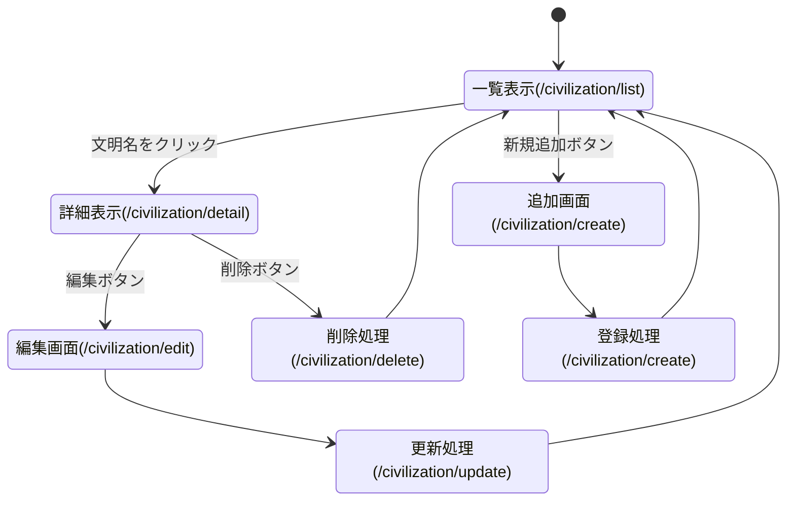

# 開発者用仕様書

## アプリ 1：四大文明一覧システム (Civilization)

### 1. データ構造

四大文明の名称、成立場所（川）、特徴などを管理するデータ構造。

```javascript
// テーブル名: civilization
const civilization = [
  {
    id: 1,
    name: "メソポタミア文明",
    river: "チグリス・ユーフラテス川",
    feature: "楔形文字、ハンムラビ法典、60進法、ジッグラト",
  },
  {
    id: 2,
    name: "エジプト文明",
    river: "ナイル川",
    feature: "象形文字（ヒエログリフ）、太陽暦、ピラミッド、スフィンクス",
  },
  {
    id: 3,
    name: "インダス文明",
    river: "インダス川",
    feature: "インダス文字、モヘンジョ=ダロ、ハラッパ、印章",
  },
  {
    id: 4,
    name: "黄河文明（中国文明）",
    river: "黄河",
    feature: "甲骨文字、青銅器、殷墟、邑",
  },
];
```



### 3. HTTP メソッドと機能詳細

| 機能・画面   | メソッド | リソース名             | 遷移元・操作                 | 機能詳細・処理内容                                                                                   |
| :----------- | :------- | :--------------------- | :--------------------------- | :--------------------------------------------------------------------------------------------------- |
| **一覧表示** | GET      | `/civilization/list`   | メニュー等のリンク           | 登録済みの文明データを一覧表示する。<br>各行に詳細・削除リンクを表示する。                           |
| **詳細表示** | GET      | `/civilization/detail` | 一覧画面の文明名リンク       | 指定された ID の文明データの詳細情報を表示する。<br>編集ボタンを表示する。                           |
| **追加画面** | GET      | `/civilization/create` | 一覧画面の「新規追加」ボタン | 新しい文明データを登録するための入力フォームを表示する。                                             |
| **登録処理** | POST     | `/civilization/create` | 追加画面の「登録」ボタン     | フォームから送信されたデータを受け取り、保存する。<br>処理後は一覧画面へリダイレクトする。           |
| **削除処理** | POST     | `/civilization/delete` | 一覧画面の「削除」ボタン     | 指定された ID の文明データを削除する。<br>処理後は一覧画面へリダイレクトする。                       |
| **編集画面** | GET      | `/civilization/edit`   | 詳細画面の「編集」ボタン     | 指定された ID の文明データを編集するための入力フォームを表示する。                                   |
| **更新処理** | POST     | `/civilization/update` | 編集画面の「更新」ボタン     | フォームから送信された変更内容を受け取り、データを更新する。<br>処理後は一覧画面へリダイレクトする。 |

---
